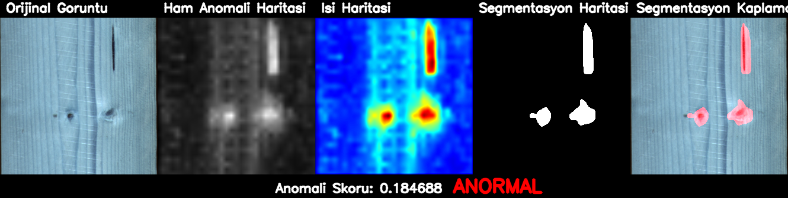

# Wood-Anomaly-Detection-Application
React is used in the front end of this project and Python Flask is used in the back end.

*DRAEM*, *FastFlow* and *Dinomaly* models were trained specifically for the wood class in the MVTec AD dataset.

You can find the sources and articles of these models from the link below. **https://paperswithcode.com/sota/anomaly-detection-on-mvtec-ad**

You need to download the model files of each model, previously trained in Colab for 20 minutes, from the link below and upload them to the folders, for example backend/models/dinomaly etc.
**https://drive.google.com/drive/folders/1-QmhTs3Lz_Gcvce4H9xoEbRdk_lJXwqO?usp=sharing**

To run this application, you must have *node.js* and *python 3.10.0* on your computer.

You must go to the backend folder with the cd backend command. Install the necessary packages with the following command.
**pip install -r requirements.txt**
Then you should run the backend with the **python app.py** command.

To run the frontend, you must open a new terminal, go to the frontend folder with the **cd frontend** command, call the **npm start** command.

Your application is READY!

The models were trained on a private wood dataset that belongs to my lecturer.

The metrics of the models are as follows.
### 📊 Dinomaly 

| Metric               | Image Score | Pixel Score |
|----------------------|-------------|-------------|
| AUROC                | 0.9109      | 0.8911      |
| AP (Average Precision)| 0.8516     | 0.2149      |
| F1 Score             | 0.8718      | 0.3036      |
| Accuracy             | 0.8582      | 0.9736      |
| Threshold            | 0.7400      | -           |
| Mean IoU             | -           | 0.1520      |

### ⚡ FastFlow 

| Metric               | Image Score | Pixel Score |
|----------------------|-------------|-------------|
| AUROC                | 0.9153      | 0.9596      |
| AP (Average Precision)| 0.8671     | 0.4086      |
| F1 Score             | 0.8800      | 0.5614      |
| Accuracy             | 0.8723      | 0.9871      |
| Threshold            | -0.2314     | -           |
| Mean IoU             | -           | 0.5107      |

### 🧠 DRAEM 

| Metric               | Image Score | Pixel Score |
|----------------------|-------------|-------------|
| AUROC                | 0.9219      | 0.8590      |
| AP (Average Precision)| 0.8752     | 0.3198      |
| F1 Score             | 0.8936      | 0.4320      |
| Accuracy             | 0.8936      | 0.9841      |
| Threshold            | 0.2961      | -           |
| Mean IoU             | -           | 0.4165      |

